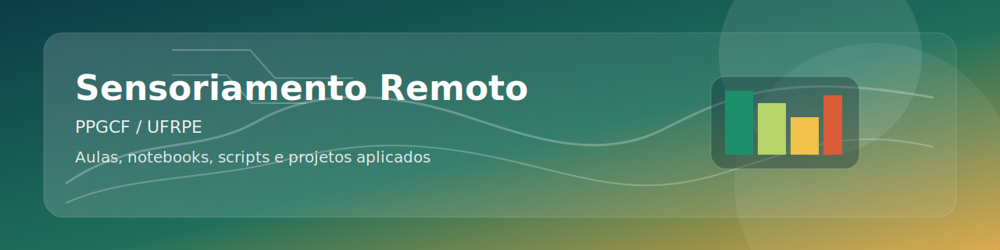

# Sensoriamento Remoto | PPGCF/UFRPE




Repositório da disciplina de Sensoriamento Remoto do Programa de Pós-Graduação em Ciências Florestais da UFRPE.

**Docente responsável:** Prof. Dr. Emanuel Araújo Silva

Esta base foi organizada para funcionar como um repositório de curso moderno: teoria, prática, códigos, projetos, automação e documentação no mesmo lugar.

## O que este repositório entrega

- trilha didática organizada por módulos
- slides e PDFs para aula
- notebooks introdutórios para demonstrações em sala
- scripts reutilizáveis para rotinas de sensoriamento remoto
- estudos de caso prontos para adaptação por semestre
- templates de colaboração e workflow de validação para manter o repositório consistente

## Para quem este material foi desenhado

- estudantes de pós-graduação com foco em geotecnologias, ciências florestais e análise ambiental
- turmas que precisam combinar base conceitual com aplicação computacional
- disciplinas que desejam sair de uma pasta de arquivos soltos e virar um repositório vivo

## Estrutura do curso

```text
Aulas_SR/
|-- .github/
|-- assets/
|   `-- img/
|-- aulas/
|   |-- en/
|   |   `-- slides/
|   `-- pt-br/
|       |-- pdf/
|       `-- slides/
|-- dados/
|-- docs/
|-- materiais/
|   `-- referencias/
|-- notebooks/
|-- projetos/
`-- scripts/
```

## Módulos

| Módulo | Foco | Base teórica | Ponte prática |
| --- | --- | --- | --- |
| 01 | Introdução e histórico | Conceitos, evolução e aplicações | Notebook 01 |
| 02 | Fundamentos físicos | Radiação, interações e resposta espectral | Notebook 02 |
| 03 | Sensores e plataformas | Fotografia aérea, sensores orbitais e resoluções | Projeto 01 |
| 04 | Imagem digital | Pixel, bandas, composições e interpretação | Notebook 03 |
| 05 | Análise aplicada | Índices, classificação e validação | Projetos 02 e 03 |

## Comece por aqui

- Materiais de aula: [aulas/README.md](./aulas/README.md)
- Cronograma sugerido: [docs/cronograma.md](./docs/cronograma.md)
- Ementa e objetivos: [docs/ementa.md](./docs/ementa.md)
- Metodologia da disciplina: [docs/metodologia.md](./docs/metodologia.md)
- Roteiro de projetos: [docs/roteiro-projetos.md](./docs/roteiro-projetos.md)
- Notebooks iniciais: [notebooks/README.md](./notebooks/README.md)
- Estudos de caso: [projetos/README.md](./projetos/README.md)
- Fontes de dados: [dados/README.md](./dados/README.md)

## Estudos de caso incluídos

| Projeto | Tema | Entrada esperada | Saídas |
| --- | --- | --- | --- |
| [01-sentinel2-indices-vegetacao](./projetos/01-sentinel2-indices-vegetacao/README.md) | NDVI e NDWI com Sentinel-2 | Bandas B02, B03, B04 e B08 | RGB, NDVI, NDWI e GeoTIFFs |
| [02-landsat-serie-temporal-vegetacao](./projetos/02-landsat-serie-temporal-vegetacao/README.md) | Delta NDVI em duas datas | Bandas vermelha e NIR de t1 e t2 | NDVI t1, NDVI t2 e delta NDVI |
| [03-mapbiomas-validacao-classificacao](./projetos/03-mapbiomas-validacao-classificacao/README.md) | Avaliação de classificação temática | Raster de referência e raster predito | Relatório textual e matriz de confusão |

## Ambiente de execução

Instalação com `pip`:

```bash
python -m venv .venv
.venv\Scripts\activate
pip install -r requirements.txt
```

Instalação com `conda`:

```bash
conda env create -f environment.yml
conda activate sensoriamento-remoto
```

## Fluxo recomendado para a disciplina

1. Apresente o conceito no slide.
2. Leve a turma para um notebook curto.
3. Mostre um projeto aplicado com dados reais.
4. Feche com interpretação técnica e implicações ambientais ou florestais.

## Manutenção do repositório

- `CONTRIBUTING.md` define o padrão para novas contribuições
- `.github/workflows/validate.yml` verifica notebooks e scripts a cada `push`
- `.github/ISSUE_TEMPLATE/` organiza novas aulas, melhorias e estudos de caso
- `CODEOWNERS` centraliza a revisão no perfil responsável

## Evolução por semestre

- crie uma branch ou tag por período letivo
- adicione novos notebooks em `notebooks/`
- converta trechos repetidos em funções dentro de `scripts/`
- publique novos estudos de caso dentro de `projetos/`

## Publicação

Repositório remoto: `https://github.com/emanuelmad/sensoriamento-remoto-ppgcf-ufrpe`
